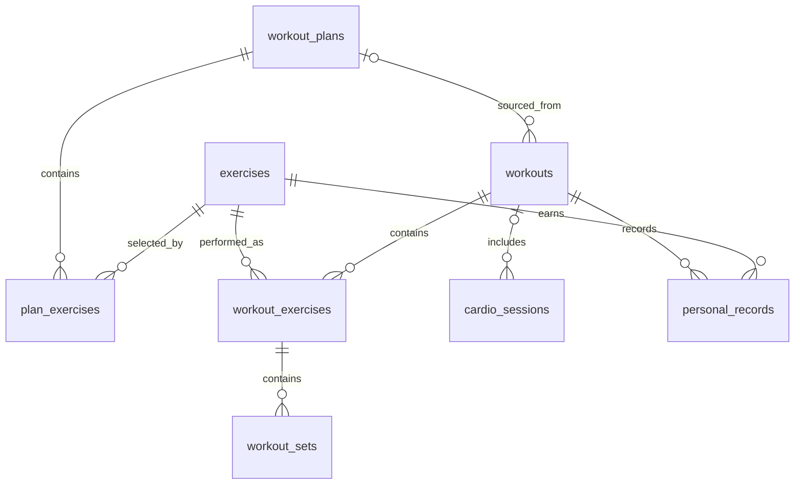

# Database

LiftDG stores primary data in the on-device SQLite database `liftdg.db`. `DatabaseProvider` opens it, enables `PRAGMA foreign_keys = ON`, applies migrations in order, and then runs idempotent seeds. The current schema version is **3**. Exercise seed version is **2** and starter-plan seed version is **1**.

## Relationships

## Tables

### `exercises`

Exercise library. `id` is the text primary key. Required columns are `name`, `category`, `exercise_type`, `created_at`, and `updated_at`; JSON text columns are `primary_muscles`, `secondary_muscles`, and `instructions`. It also stores `equipment`, `is_builtin`, and `is_archived`. Indexes cover `name` and `category`. Stable built-in IDs are upserted by the seed; built-ins cannot be edited or archived through the repository. Custom exercises can be edited and archived.

### `workout_plans`

Reusable templates. `id` is the text primary key. Columns are `name`, `description`, `color`, `is_builtin`, `is_archived`, `created_at`, and `updated_at`. `updated_at` is indexed. Built-in plans are immutable templates: they may be duplicated or hidden, but not edited or deleted. User plans support normal lifecycle operations.

### `plan_exercises`

Ordered plan membership and targets. `id` is the primary key; `plan_id` references `workout_plans(id)` with `ON DELETE CASCADE`; `exercise_id` references `exercises(id)`. Other columns are `exercise_order`, `target_sets`, `target_reps_min`, `target_reps_max`, `target_weight`, `rest_seconds`, and `notes`. Both foreign keys are indexed. Multi-row replacements and reorders run in transactions.

### `workouts`

Workout session header. `id` is the primary key; nullable `plan_id` references `workout_plans(id)` with `ON DELETE SET NULL`. Columns are `name`, `workout_type`, `started_at`, `completed_at`, `duration_seconds`, `notes`, `status`, `created_at`, and `updated_at`. Indexes cover `started_at` and `status`; a partial unique index permits only one `active` row. Status values used by the application are `active`, `completed`, and `cancelled`.

### `workout_exercises`

An immutable exercise snapshot within a workout. `id` is the primary key; `workout_id` references `workouts(id)` and `exercise_id` references `exercises(id)`, both with `ON DELETE CASCADE`. It stores order, copied target fields, rest time, notes, and start/completion timestamps. `workout_id` and `exercise_id` are indexed. Plan targets are copied here when a workout starts, so later plan edits cannot change past sessions.

### `workout_sets`

Immediately persisted set data. `id` is the primary key and `workout_exercise_id` references `workout_exercises(id)` with `ON DELETE CASCADE`. Columns include `set_number`, `weight`, `reps`, legacy/reserved `duration_seconds` and `distance`, `set_type`, `rpe`, `completed`, `completed_at`, `notes`, `created_at`, and `updated_at`. Indexes cover the parent ID and completion flag. Supported types are `warmup`, `working`, `drop`, `failure`, and `bodyweight`.

### `cardio_sessions`

Schema scaffolding for planned Phase 6 cardio support. `id` is the primary key; nullable `workout_id` references `workouts(id)` with `ON DELETE SET NULL`. It stores activity, date, duration, distance, calories, heart-rate values, pace, notes, and timestamps. `date` is indexed. No cardio UI is implemented yet.

### `personal_records`

Schema scaffolding for planned Phase 5 records. `id` is the primary key. `exercise_id` references exercises, `workout_id` references workouts, and nullable `workout_set_id` references sets; all use `ON DELETE CASCADE`. It stores record type, value, and achievement date. Exercise lookup is indexed and a unique index prevents duplicate type/value records per exercise. No record detection UI is implemented yet.

### `app_settings`

Key/value settings table with text primary key `key`, `value`, and `updated_at`. Primary workout data never belongs in AsyncStorage; AsyncStorage is reserved for lightweight UI preferences and recoverable rest-timer state.

## Migrations and seeds

- Migration 1 creates the base tables and core indexes.
- Migration 2 adds plan archival and plan lookup indexes.
- Migration 3 adds workout target snapshots, set audit timestamps, workout indexes, and the single-active-workout constraint.
- Seeds use stable IDs and version keys in `app_settings`. Upserts add or refresh built-in templates without duplicating user data.

Released migrations must never be edited. Every schema change gets a new numbered migration. Creating a workout from a plan, duplicating/replacing a plan, removing an exercise aggregate, discarding, and other multi-table writes use SQLite transactions.
