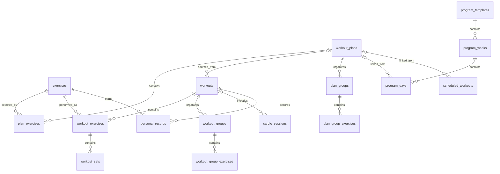

# Database

LiftDG stores primary data in the on-device SQLite database `liftdg.db`. `DatabaseProvider` opens it, enables `PRAGMA foreign_keys = ON`, applies migrations in order, and then runs idempotent seeds. The current schema version is **14**. Exercise seed version is **3**, starter-plan seed version is **2**, exercise-video seed version is **13**, and program seed version is **1**.

## Relationships



## Tables

### `exercises`

Exercise library. `id` is the text primary key. Required columns are `name`, `category`, `exercise_type`, `created_at`, and `updated_at`; JSON text columns are `primary_muscles`, `secondary_muscles`, and `instructions`. It also stores `equipment`, `is_builtin`, and `is_archived`. Indexes cover `name` and `category`. Stable built-in IDs are upserted by the seed; built-ins cannot be edited or archived through the repository. Custom exercises can be edited and archived.

### `workout_plans`

Reusable templates (shown as "Training" in the UI — DECISIONS.md #43). `id` is the text primary key. Columns are `name`, `description`, `color`, `workout_type`, `is_builtin`, `is_archived`, `created_at`, and `updated_at`. `updated_at` and `workout_type` are indexed. `workout_type` (migration 11, DECISIONS.md #44) is one of `strength`/`running`/`cycling`/`swimming`/`walking`/`yoga`/`mobility`/`hiit`/`hybrid`/`other`, defaulting to `strength` — every plan created before this column existed was strength-only, so the default is accurate for all pre-existing data. Only `strength` has a dedicated exercise editor today; the other values are tags for a future type-specific editor. Built-in plans are immutable templates: they may be duplicated or hidden, but not edited or deleted. User plans support normal lifecycle operations.

### `plan_exercises`

Ordered plan membership and targets. `id` is the primary key; `plan_id` references `workout_plans(id)` with `ON DELETE CASCADE`; `exercise_id` references `exercises(id)`. Other columns include order, set/rep/weight targets, duration/distance targets, rest time, and notes. Both foreign keys are indexed. Multi-row replacements and reorders run in transactions.

### `program_templates`, `program_weeks`, `program_days`

Multi-week programs (migration 12, DECISIONS.md #45). A program has many weeks (`program_weeks`, unique on `(program_id, week_number)`, each optionally flagged `is_deload`/`is_assessment`), and each week has many days (`program_days`, ordered by `display_order`). A day is either a rest day (`is_rest_day = 1`, no plan) or links to an existing `workout_plans` row via nullable `plan_id` (`ON DELETE SET NULL`, so deleting a plan un-links the day instead of breaking the program) — there is no separate "program workout" content table; a program day's content **is** a plan. `program_templates.version` exists for future use once programs become editable and active/in-progress programs need to remember which version they started from. This phase is read-only: no create/edit/duplicate/favorite/start/pause/resume yet, only seeded built-in programs and a preview screen.

### `scheduled_workouts`

One-time calendar entries (migration 13, DECISIONS.md #46). `id` is the primary key; nullable `plan_id` references `workout_plans(id)` with `ON DELETE SET NULL` — deleting the source plan un-links the item rather than deleting calendar history. `scheduled_date` is a plain `YYYY-MM-DD` string (never a UTC instant), so it can never shift a day from timezone conversion; `daypart` (`morning`/`afternoon`/`evening`/`anytime`) and `start_time` are independent, nullable, and never force each other. `snapshot_name`/`snapshot_workout_type` capture the plan's name/type at scheduling time so a later plan edit never rewrites what was already scheduled. `status` defaults to `scheduled`; only that value is produced today (no completion/missed-reconciliation logic yet). Indexed on `scheduled_date`, `plan_id`, and `status`. There is no Month/Week view, drag-and-drop, conflict detection, recurring schedules, or notification integration yet — this is Agenda-view, one-time scheduling only.

Migration 14 (DECISIONS.md #47) adds three nullable columns — `program_id`, `program_week_number`, `program_day_id` — populated only by "Start Program." These are plain columns, not enforced foreign keys (SQLite's `ALTER TABLE ADD COLUMN` doesn't get the same FK enforcement as a `CREATE TABLE`-time constraint, and no other migration in this codebase relies on that either), and there is no `active_programs` table or pause/resume/end lifecycle — `program_id IS NOT NULL` is the entire definition of "this calendar item belongs to a program." Editing or removing a program-linked occurrence is a plain single-row update/delete, identical to an independent item, because only one edit scope ("this occurrence only") exists so far.

### `workouts`

Workout session header. `id` is the primary key; nullable `plan_id` references `workout_plans(id)` with `ON DELETE SET NULL`. Columns are `name`, `workout_type`, `started_at`, `completed_at`, `duration_seconds`, `notes`, `status`, `created_at`, and `updated_at`. Indexes cover `started_at`, `completed_at`, and `status`; a partial unique index permits only one `active` row. Status values used by the application are `active`, `completed`, and `cancelled`.

### `workout_exercises`

An immutable exercise snapshot within a workout. `id` is the primary key; `workout_id` references `workouts(id)` and `exercise_id` references `exercises(id)`, both with `ON DELETE CASCADE`. It stores order, copied target fields, rest time, notes, and start/completion timestamps. `workout_id` and `exercise_id` are indexed. Plan targets are copied here when a workout starts, so later plan edits cannot change past sessions.

### `workout_sets`

Immediately persisted set data. `id` is the primary key and `workout_exercise_id` references `workout_exercises(id)` with `ON DELETE CASCADE`. It stores repetitions, weight, duration, distance, RPE, completion/audit fields, grouping/stage/round metadata, assistance/bodyweight/added weight, duration/distance targets, and AMRAP state. Supported types are `warmup`, `working`, `drop`, `rest_pause`, `failure`, `bodyweight`, `assisted`, `timed`, `distance`, and `amrap`. Drop/rest-pause stages are real rows sharing `group_id`; no parent placeholder is counted.

### `workout_groups` / `workout_group_exercises`

Supersets, giant sets, and circuits plus ordered workout-exercise membership. Cascades remove membership when its group or exercise disappears. Deleting only a group preserves its exercises.

### `plan_groups` / `plan_group_exercises`

Plan-level group definitions and ordered membership. Starting or duplicating a grouped plan generates new IDs and copies values so later template edits cannot change an existing workout.

### `cardio_sessions`

Persisted standalone and mixed-workout cardio. Nullable workout and workout-exercise foreign keys cascade. It stores activity, date, duration, canonical kilometer distance, calories, heart rate, elevation, pace, speed, cadence, rounds, notes, and timestamps. Workout, exercise, date, and activity are indexed.

### `cardio_personal_records`

Cardio bests tied to a session. Fastest pace is lower-is-better and requires at least 0.5 km. Session deletion cascades.

### `personal_records`

Strength personal-record history. `id` is the primary key. `exercise_id` references exercises with `ON DELETE RESTRICT`, `workout_id` references workouts with `ON DELETE CASCADE`, and nullable `workout_set_id` references sets with `ON DELETE SET NULL`. Columns are `record_type` (`max_weight`, `max_reps`, `best_set_volume`, `estimated_one_rep_max`, `best_workout_volume`), `value`, nullable `secondary_value` (e.g. the weight used alongside a `max_reps` record), `achieved_at`, `created_at`, and `updated_at`. `exercise_id`, `record_type`, `achieved_at`, and `workout_id` are indexed; a unique index on `(exercise_id, record_type, value, workout_id)` prevents the same record from being stored twice for one workout. Every past best is kept as history rather than only the latest value — see DECISIONS.md #18.

### `water_entries`

One row per logged water intake. `id` is the primary key; `amount_ml` is stored in canonical milliliters (converted to L or US fl oz only at display boundaries, matching the kg/km/cm convention in DECISIONS.md #9); `logged_at` is indexed for the day/week/month/quarter/year rollups computed in `hydrationService`. `source` records how the entry was created (`quick_add`, `custom_add`, `edited`, `imported`) and nullable `notes` holds a short optional note. There is no goal/streak column here — daily goal, serving size, and unit preference live in `app_settings` (Hydration settings), and streaks/goal-days are derived, not stored.

### `hydration_goal_history`

Records when the daily water goal changed. `id` is the primary key; `goal_ml` is the goal that applies from `effective_from` onward until superseded by a later row. `effective_from` is a **local date key** (`yyyy-MM-dd`), not an instant — goal changes are always "starting from this calendar day." A unique index on `effective_from` means one goal change per day; `hydrationService.resolveGoalForDate` walks this history to find the goal that applied to any given historical date, so changing today's goal never silently rewrites how past days are graded. See DECISIONS.md #35.

### `exercise_default_videos`

Curated technique videos, seeded content only — never user-editable or deletable through the app. `id` is the primary key; `exercise_id` references `exercises(id)` with `ON DELETE CASCADE`. Columns are `title`, `video_id` (the YouTube video ID, not a full URL), nullable `channel_name`/`thumbnail_url`, and `sort_order`. A unique index on `(exercise_id, video_id)` makes re-seeding idempotent. Ships with **zero rows** until real, verified links are added — see DECISIONS.md.

### `exercise_saved_videos`

A user's own videos for one exercise: addable, renamable, favoritable, reorderable, and deletable — entirely separate from `exercise_default_videos`. `id` is the primary key; `exercise_id` references `exercises(id)` with `ON DELETE CASCADE`. Columns are `video_id`, `title` (user-editable, independent of the video's real YouTube title), nullable `channel_name`/`thumbnail_url`, `youtube_url`, `is_favorite`, `sort_order`, and `saved_at`. A unique index on `(exercise_id, video_id)` prevents saving the same video twice for one exercise. Only one row per exercise may have `is_favorite = 1`; `exerciseVideoRepository.toggleFavoriteVideo` enforces this by clearing every favorite for the exercise before (optionally) re-setting the target.

### `app_settings`

Key/value settings table with text primary key `key`, `value`, and `updated_at`. Primary workout data never belongs in AsyncStorage; AsyncStorage is reserved for lightweight UI preferences and recoverable rest-timer state.

Behavior preferences use `preference.*` keys containing validated JSON scalar values. Seed metadata uses separate keys and survives a settings reset. App-lock enablement is stored in SecureStore; workout data is never stored there.

## Backup format

Backup format version **2** is independent of the database schema version and predates hydration, the exercise video library, programs, and the calendar — `water_entries`, `hydration_goal_history`, `exercise_default_videos`/`exercise_saved_videos`, `program_templates`/`program_weeks`/`program_days`, and `scheduled_workouts` are not yet in the backed-up table set (a future format version should add them). It contains every domain table current as of format 2: profile, weight, measurement definitions, sessions, and values, plus exercises/plans/workouts/cardio/records. Replace deletes children before parents and imports parents before children. Merge matches stable IDs, accepts newer `updated_at` rows, and skips equal or older rows. Format-1 files are normalized with empty Phase 9 collections. Both modes use one exclusive transaction and an integrity check. The UI creates a local pre-restore snapshot before either mode.

## Migrations and seeds

- Migration 1 creates the base tables and core indexes.
- Migration 2 adds plan archival and plan lookup indexes.
- Migration 3 adds workout target snapshots, set audit timestamps, workout indexes, and the single-active-workout constraint.
- Migration 4 adds the completed-time index used by history pagination and sorting.
- Migration 5 adds `personal_records.secondary_value`/`created_at`/`updated_at`, replaces the unique index with `(exercise_id, record_type, value, workout_id)` so the same record can't be stored twice for one workout, and indexes `record_type`, `achieved_at`, and `workout_id`.
- Migration 6 adds cardio metrics and records, workout/plan groups, advanced set fields, duration/distance plan targets, and their indexes.
- Migration 7 adds the profile, historical weight, measurement definition/session/value tables, indexes, and stable built-in measurement definitions.
- Migration 8 adds `water_entries` (canonical milliliters, indexed by `logged_at`) for Phase 10 hydration tracking.
- Migration 9 adds `water_entries.source`/`notes` and the `hydration_goal_history` table (unique/indexed on `effective_from`) for historical hydration exploration and goal-aware grading.
- Migration 10 adds `exercise_default_videos` and `exercise_saved_videos`, both indexed and uniquely constrained on `(exercise_id, video_id)`, for the exercise video library.
- Migration 11 adds `workout_plans.workout_type` (indexed), defaulted to `strength` for all existing rows — the first foundation step of the "Training" evolution (DECISIONS.md #44).
- Migration 12 adds `program_templates`, `program_weeks`, and `program_days` — a read-only multi-week program layer whose days link to existing `workout_plans` rows (DECISIONS.md #45).
- Migration 13 adds `scheduled_workouts` — one-time calendar items linking a local `YYYY-MM-DD` date to an existing plan, with a name/type snapshot (DECISIONS.md #46).
- Migration 14 adds `program_id`/`program_week_number`/`program_day_id` to `scheduled_workouts`, populated by "Start Program" (DECISIONS.md #47).
- Seeds use stable IDs and version keys in `app_settings`. Upserts add or refresh built-in templates without duplicating user data.

"Search YouTube" hands off to youtube.com's own search (DECISIONS.md #39) rather than calling an API with a stored key, so there is no YouTube-related credential in `app_settings`, any table, or SecureStore.

Released migrations must never be edited. Every schema change gets a new numbered migration. History loads 20 completed workouts at a time. Search uses parameterized `LIKE` predicates plus an `EXISTS` exercise lookup. Repeat, duplicate-as-plan, completed-workout replacement, and deletion use transactions; child deletion relies on documented cascades.
## Phase 9 profile and measurements (schema version 7)

- `user_profile`: one optional local profile using stable ID `local-user-profile`; optional birth date, height in centimeters, current weight in kilograms, and notes.
- `body_weight_entries`: historical kilogram readings owned by the profile (`ON DELETE CASCADE`), indexed by profile and measurement time.
- `measurement_types`: stable built-in measurement definitions, category, display order, and visibility. Hiding a type changes `is_active`; it never deletes values.
- `body_measurement_entries`: dated measurement sessions owned by the profile (`ON DELETE CASCADE`) with optional weight and notes.
- `body_measurement_values`: normalized centimeter values owned by a session (`ON DELETE CASCADE`) and restricted to a valid measurement type. `(entry_id, measurement_type_id)` is unique.

```text
user_profile
├── body_weight_entries
└── body_measurement_entries
    └── body_measurement_values ── measurement_types
```

Migration 7 seeds neck, shoulders, chest, waist, abdomen, hips, separate left/right biceps, forearms, thighs, calves, glutes, wrist, and ankle types. Weight and body measurements are canonical kg/cm values; unit preferences never rewrite stored history.
