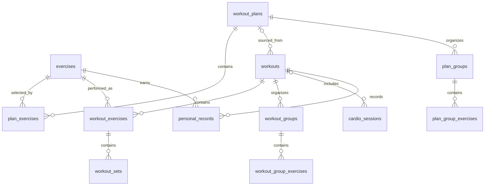

# Database

LiftDG stores primary data in the on-device SQLite database `liftdg.db`. `DatabaseProvider` opens it, enables `PRAGMA foreign_keys = ON`, applies migrations in order, and then runs idempotent seeds. The current schema version is **7**. Exercise seed version is **2** and starter-plan seed version is **1**.

## Relationships



## Tables

### `exercises`

Exercise library. `id` is the text primary key. Required columns are `name`, `category`, `exercise_type`, `created_at`, and `updated_at`; JSON text columns are `primary_muscles`, `secondary_muscles`, and `instructions`. It also stores `equipment`, `is_builtin`, and `is_archived`. Indexes cover `name` and `category`. Stable built-in IDs are upserted by the seed; built-ins cannot be edited or archived through the repository. Custom exercises can be edited and archived.

### `workout_plans`

Reusable templates. `id` is the text primary key. Columns are `name`, `description`, `color`, `is_builtin`, `is_archived`, `created_at`, and `updated_at`. `updated_at` is indexed. Built-in plans are immutable templates: they may be duplicated or hidden, but not edited or deleted. User plans support normal lifecycle operations.

### `plan_exercises`

Ordered plan membership and targets. `id` is the primary key; `plan_id` references `workout_plans(id)` with `ON DELETE CASCADE`; `exercise_id` references `exercises(id)`. Other columns include order, set/rep/weight targets, duration/distance targets, rest time, and notes. Both foreign keys are indexed. Multi-row replacements and reorders run in transactions.

### `workouts`

Workout session header. `id` is the primary key; nullable `plan_id` references `workout_plans(id)` with `ON DELETE SET NULL`. Columns are `name`, `workout_type`, `started_at`, `completed_at`, `duration_seconds`, `notes`, `status`, `created_at`, and `updated_at`. Indexes cover `started_at`, `completed_at`, and `status`; a partial unique index permits only one `active` row. Status values used by the application are `active`, `completed`, and `cancelled`.

### `workout_exercises`

An immutable exercise snapshot within a workout. `id` is the primary key; `workout_id` references `workouts(id)` and `exercise_id` references `exercises(id)`, both with `ON DELETE CASCADE`. It stores order, copied target fields, rest time, notes, and start/completion timestamps. `workout_id` and `exercise_id` are indexed. Plan targets are copied here when a workout starts, so later plan edits cannot change past sessions.

### `workout_sets`

Immediately persisted set data. `id` is the primary key and `workout_exercise_id` references `workout_exercises(id)` with `ON DELETE CASCADE`. It stores repetitions, weight, duration, distance, RPE, completion/audit fields, grouping/stage/round metadata, assistance/bodyweight/added weight, duration/distance targets, and AMRAP state. Supported types are `warmup`, `working`, `drop`, `rest_pause`, `failure`, `bodyweight`, `assisted`, `timed`, `distance`, and `amrap`. Drop/rest-pause stages are real rows sharing `group_id`; no parent placeholder is counted.

### `workout_groups` / `workout_group_exercises`

Supersets, giant sets, and circuits plus ordered workout-exercise membership. Cascades remove membership when its group or exercise disappears. Deleting only a group preserves its exercises.

### `plan_groups` / `plan_group_exercises`

Plan-level group definitions and ordered membership. Starting or duplicating a grouped plan generates new IDs and copies values so later template edits cannot change an existing workout.

### `cardio_sessions`

Persisted standalone and mixed-workout cardio. Nullable workout and workout-exercise foreign keys cascade. It stores activity, date, duration, canonical kilometer distance, calories, heart rate, elevation, pace, speed, cadence, rounds, notes, and timestamps. Workout, exercise, date, and activity are indexed.

### `cardio_personal_records`

Cardio bests tied to a session. Fastest pace is lower-is-better and requires at least 0.5 km. Session deletion cascades.

### `personal_records`

Strength personal-record history. `id` is the primary key. `exercise_id` references exercises with `ON DELETE RESTRICT`, `workout_id` references workouts with `ON DELETE CASCADE`, and nullable `workout_set_id` references sets with `ON DELETE SET NULL`. Columns are `record_type` (`max_weight`, `max_reps`, `best_set_volume`, `estimated_one_rep_max`, `best_workout_volume`), `value`, nullable `secondary_value` (e.g. the weight used alongside a `max_reps` record), `achieved_at`, `created_at`, and `updated_at`. `exercise_id`, `record_type`, `achieved_at`, and `workout_id` are indexed; a unique index on `(exercise_id, record_type, value, workout_id)` prevents the same record from being stored twice for one workout. Every past best is kept as history rather than only the latest value — see DECISIONS.md #18.

### `app_settings`

Key/value settings table with text primary key `key`, `value`, and `updated_at`. Primary workout data never belongs in AsyncStorage; AsyncStorage is reserved for lightweight UI preferences and recoverable rest-timer state.

Behavior preferences use `preference.*` keys containing validated JSON scalar values. Seed metadata uses separate keys and survives a settings reset. App-lock enablement is stored in SecureStore; workout data is never stored there.

## Backup format

Backup format version **2** is independent of database version **7**. It contains every current domain table, including profile, weight, measurement definitions, sessions, and values. Replace deletes children before parents and imports parents before children. Merge matches stable IDs, accepts newer `updated_at` rows, and skips equal or older rows. Format-1 files are normalized with empty Phase 9 collections. Both modes use one exclusive transaction and an integrity check. The UI creates a local pre-restore snapshot before either mode.

## Migrations and seeds

- Migration 1 creates the base tables and core indexes.
- Migration 2 adds plan archival and plan lookup indexes.
- Migration 3 adds workout target snapshots, set audit timestamps, workout indexes, and the single-active-workout constraint.
- Migration 4 adds the completed-time index used by history pagination and sorting.
- Migration 5 adds `personal_records.secondary_value`/`created_at`/`updated_at`, replaces the unique index with `(exercise_id, record_type, value, workout_id)` so the same record can't be stored twice for one workout, and indexes `record_type`, `achieved_at`, and `workout_id`.
- Migration 6 adds cardio metrics and records, workout/plan groups, advanced set fields, duration/distance plan targets, and their indexes.
- Migration 7 adds the profile, historical weight, measurement definition/session/value tables, indexes, and stable built-in measurement definitions.
- Seeds use stable IDs and version keys in `app_settings`. Upserts add or refresh built-in templates without duplicating user data.

Released migrations must never be edited. Every schema change gets a new numbered migration. History loads 20 completed workouts at a time. Search uses parameterized `LIKE` predicates plus an `EXISTS` exercise lookup. Repeat, duplicate-as-plan, completed-workout replacement, and deletion use transactions; child deletion relies on documented cascades.
## Phase 9 profile and measurements (schema version 7)

- `user_profile`: one optional local profile using stable ID `local-user-profile`; optional birth date, height in centimeters, current weight in kilograms, and notes.
- `body_weight_entries`: historical kilogram readings owned by the profile (`ON DELETE CASCADE`), indexed by profile and measurement time.
- `measurement_types`: stable built-in measurement definitions, category, display order, and visibility. Hiding a type changes `is_active`; it never deletes values.
- `body_measurement_entries`: dated measurement sessions owned by the profile (`ON DELETE CASCADE`) with optional weight and notes.
- `body_measurement_values`: normalized centimeter values owned by a session (`ON DELETE CASCADE`) and restricted to a valid measurement type. `(entry_id, measurement_type_id)` is unique.

```text
user_profile
├── body_weight_entries
└── body_measurement_entries
    └── body_measurement_values ── measurement_types
```

Migration 7 seeds neck, shoulders, chest, waist, abdomen, hips, separate left/right biceps, forearms, thighs, calves, glutes, wrist, and ankle types. Weight and body measurements are canonical kg/cm values; unit preferences never rewrite stored history.
